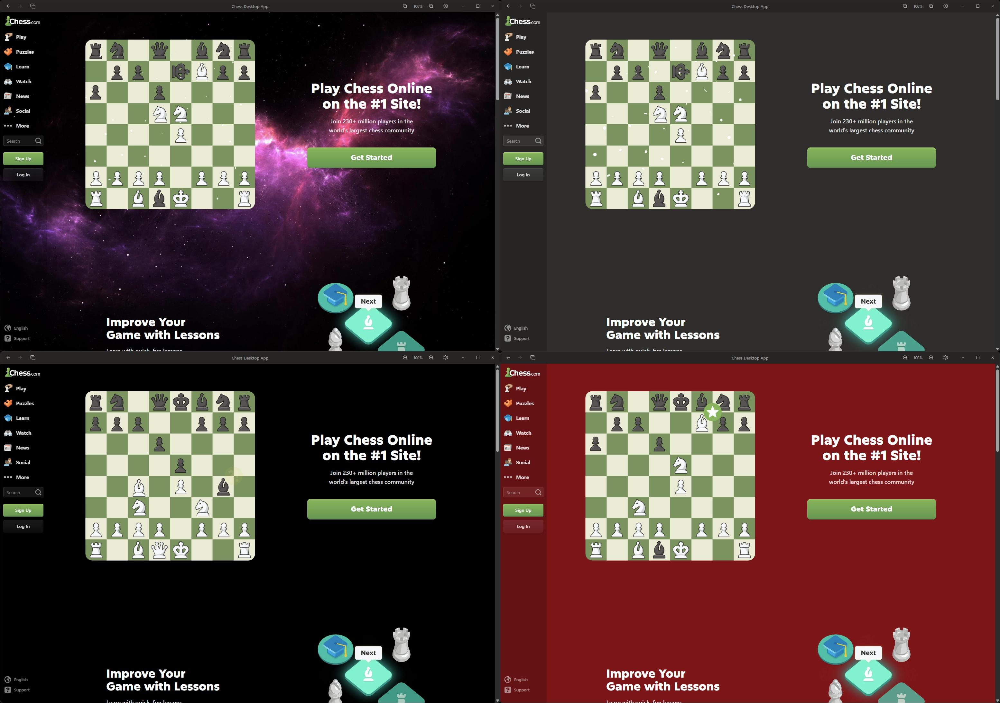

# Chess Desktop App

A modern desktop client for Chess.com with enhanced native features.

[](https://github.com/wemune/chess-desktop-app/releases/latest/download/Chess-Desktop-App-Setup.exe)
&nbsp;&nbsp;&nbsp;
[-black?style=for-the-badge&logo=apple)](https://github.com/wemune/chess-desktop-app/releases/latest/download/Chess-Desktop-App-arm64.dmg)
&nbsp;&nbsp;&nbsp;
[-black?style=for-the-badge&logo=apple)](https://github.com/wemune/chess-desktop-app/releases/latest/download/Chess-Desktop-App-x64.dmg)
&nbsp;&nbsp;&nbsp;
[-FCC624?style=for-the-badge&logo=linux&logoColor=white)](https://github.com/wemune/chess-desktop-app/releases/latest/download/Chess-Desktop-App-x86_64.AppImage)
&nbsp;&nbsp;&nbsp;
[-FCC624?style=for-the-badge&logo=linux&logoColor=white)](https://github.com/wemune/chess-desktop-app/releases/latest/download/Chess-Desktop-App-amd64.deb)
&nbsp;&nbsp;&nbsp;
[](https://github.com/wemune/chess-desktop-app/releases)



## Disclaimer

**This is an unofficial, third-party application and is not affiliated with, endorsed by, or connected to Chess.com in any way.** This app is simply a wrapper that provides a native desktop experience for the Chess.com website.

**For copyright concerns or takedown requests:** Please contact [contact@chessdesktop.app](mailto:contact@chessdesktop.app)

## Installation

**Quick Download:** Use the download badges at the top of this page for the latest version.

### Windows

1. Download `Chess-Desktop-App-Setup.exe` from the [Releases](../../releases) page
2. Run the installer and follow the prompts

### macOS

**Important:** Since this app is not code-signed, macOS will block it by default. Follow these steps to bypass the security warning:

1. Download the appropriate DMG for your Mac:
   - **Apple Silicon** (M-series): `Chess-Desktop-App-arm64.dmg`
   - **Intel**: `Chess-Desktop-App-x64.dmg`
2. Open the DMG and drag the app to Applications
3. Open Terminal and run this command to remove the quarantine flag:
   ```bash
   xattr -cr "/Applications/Chess Desktop App.app"
   ```
4. Launch the app normally - it should now open without warnings

### Linux

1. Download your preferred package from the [Releases](../../releases) page:
   - **AppImage**: `Chess-Desktop-App-x86_64.AppImage` (Universal, no installation required)
   - **Debian/Ubuntu**: `Chess-Desktop-App-amd64.deb`
2. For AppImage:
   ```bash
   chmod +x Chess-Desktop-App-x86_64.AppImage
   ./Chess-Desktop-App-x86_64.AppImage
   ```
3. For DEB package:
   ```bash
   sudo apt install ./Chess-Desktop-App-amd64.deb
   ```

The app will automatically check for updates on startup and notify you when a new version is available.

## Features

- **Native Desktop Experience** - Full-featured desktop app for Windows, macOS, and Linux
- **Custom Themes** - Choose from multiple background themes to personalize your Chess.com experience
- **Seamless Navigation** - Back/forward buttons and keyboard shortcuts (Alt+Left/Right)
- **Copy URL** - Quickly copy the current page URL with one-click button and visual feedback
- **Zoom Controls** - Easily adjust text size with zoom in/out buttons or keyboard shortcuts (Ctrl/Cmd +/-)
- **Zoom Limits** - Safe zoom range to prevent UI breaking (33% - 250%)
- **Desktop Notifications** - Receive notifications from Chess.com (toggle on/off in settings)
- **Window Management** - Toggle always on top mode to keep app above other windows
- **Audio Control** - Mute all Chess.com sounds with one toggle
- **Chat Toggle** - Show or hide the chat component on Chess.com
- **Hardware Acceleration** - Toggle GPU rendering (requires restart)
- **Loading Indicators** - Visual feedback during page loads with 30-second timeout
- **Error Handling** - Graceful error recovery with retry functionality
- **Persistent Settings** - Remembers your window size, position, zoom level, theme, and all preferences
- **Auto-Updates** - Automatically downloads updates and installs on restart
- **Logging** - Detailed logs for troubleshooting with quick access button in settings

## Keyboard Shortcuts

- `Ctrl/Cmd + R` or `F5` - Reload page
- `Ctrl/Cmd + Plus` - Zoom in
- `Ctrl/Cmd + Minus` - Zoom out
- `Ctrl/Cmd + 0` - Reset zoom to 100%
- `Alt + Left` - Go back
- `Alt + Right` - Go forward

**Note:** You can also click the zoom percentage display to quickly reset to 100%.

## Settings

Access settings by clicking the gear icon in the titlebar. Available options:

### General
- **Theme** - Select from multiple background themes
- **Chat** - Show or hide the Chess.com chat component
- **Mute All Sounds** - Disable all audio from Chess.com
- **Notifications** - Enable or disable desktop notifications from Chess.com

### Window
- **Always on Top** - Keep the app window above all other windows

### Advanced
- **Hardware Acceleration** - Enable or disable GPU rendering (requires app restart)

All settings are automatically saved and persist across app restarts.

## Security & Privacy

- **Domain Restricted** - Only navigates to Chess.com domains
- **External Links** - Non-Chess.com links open in your default browser
- **Privacy First** - No data collection or tracking beyond standard Chess.com usage

## Troubleshooting

### Logs Location

The app uses `electron-log` to store detailed logs for debugging. You can quickly access the logs folder by clicking the document icon in the Settings modal.

**Log file locations:**
- **Windows:** `%USERPROFILE%\AppData\Roaming\Chess Desktop App\logs\`
- **macOS:** `~/Library/Logs/Chess Desktop App/`
- **Linux:** `~/.config/Chess Desktop App/logs/`

Check these logs if you encounter issues. The logs include:
- Application startup and shutdown
- Update checks and downloads
- Navigation events
- Error messages and warnings

### Common Issues

**Connection errors:**
- Check your internet connection
- Click the "Retry" button on the error screen
- If issues persist, check the log files

**Zoom too small/large:**
- Click the zoom percentage display to reset to 100%
- Or use `Ctrl/Cmd + 0` keyboard shortcut

**Updates not working:**
- Updates require the app to be installed (not portable version)
- Check logs for update errors
- Manually download latest version from releases

For bugs or issues, please [open an issue](../../issues) on GitHub and include relevant log excerpts.

## License

MIT License - See [LICENSE](LICENSE) file for details.

This project is open source software. Chess.com and its logo are trademarks of Chess.com LLC.

## Contact

- **General inquiries:** [contact@chessdesktop.app](mailto:contact@chessdesktop.app)
- **Issues & bugs:** [Open an issue](../../issues) on GitHub
- **Copyright/takedown requests:** [contact@chessdesktop.app](mailto:contact@chessdesktop.app)
